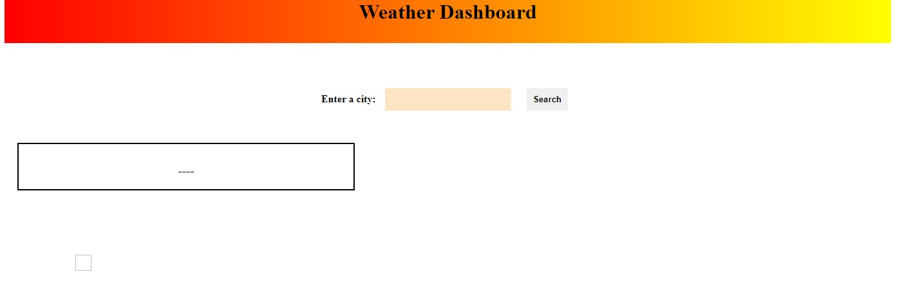

# weather-dashboard
challenge 6

This is the screenshot of my to css file.

This is the screenshot of my link to js.

This is a 5 Day Weather Forecast!

As the front of the page, is the basic display of it.

This is how it should look like, once you enter in a city.

AS you can see the bottom black box, that is the previous search box.

Once you press the search button, you should have the result of a current and 5 day forecast of Temp, Wind and Humidity.

- unfortunetly I don't have an image of the completed part.

